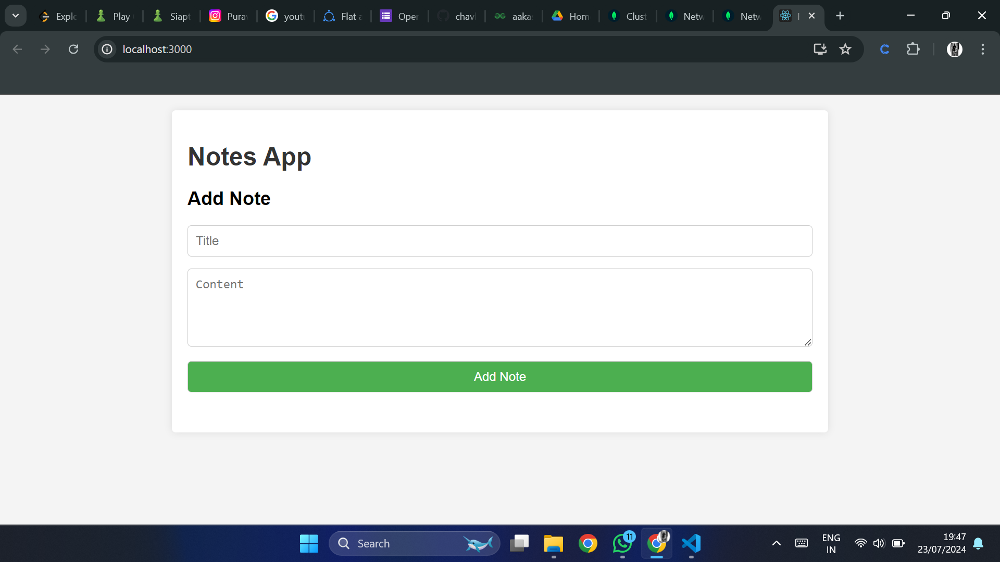
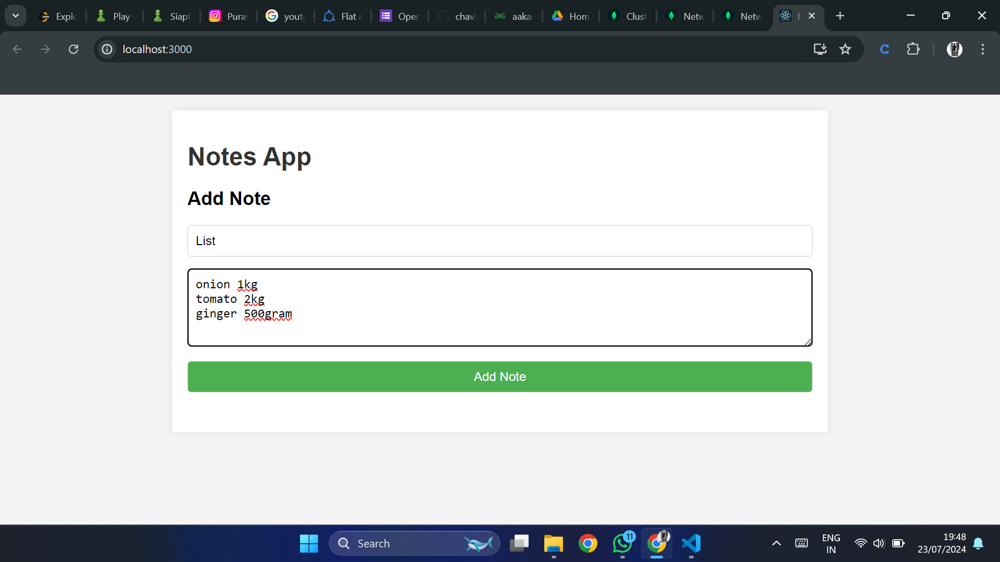
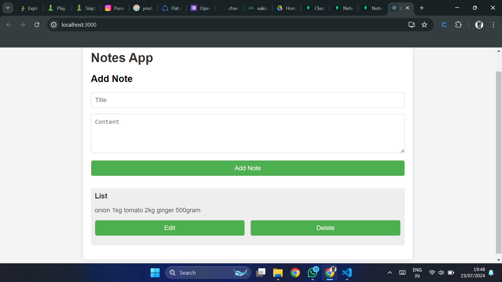
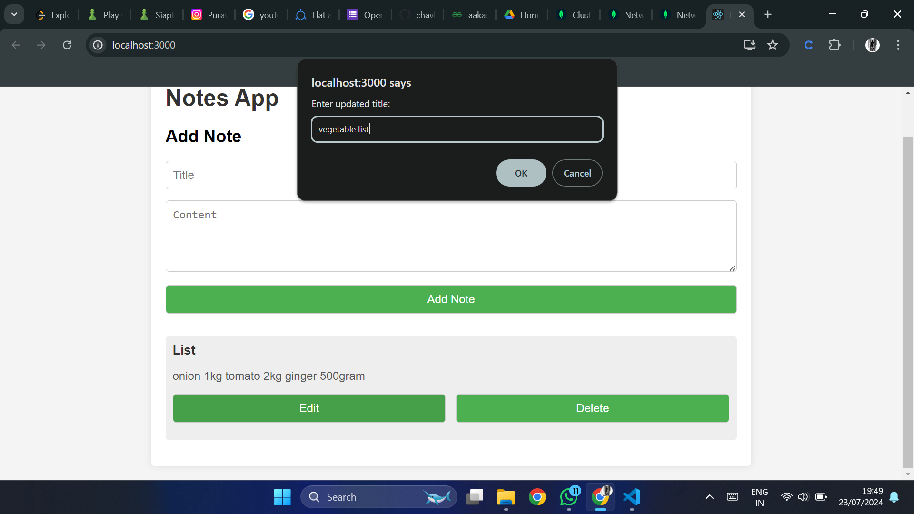
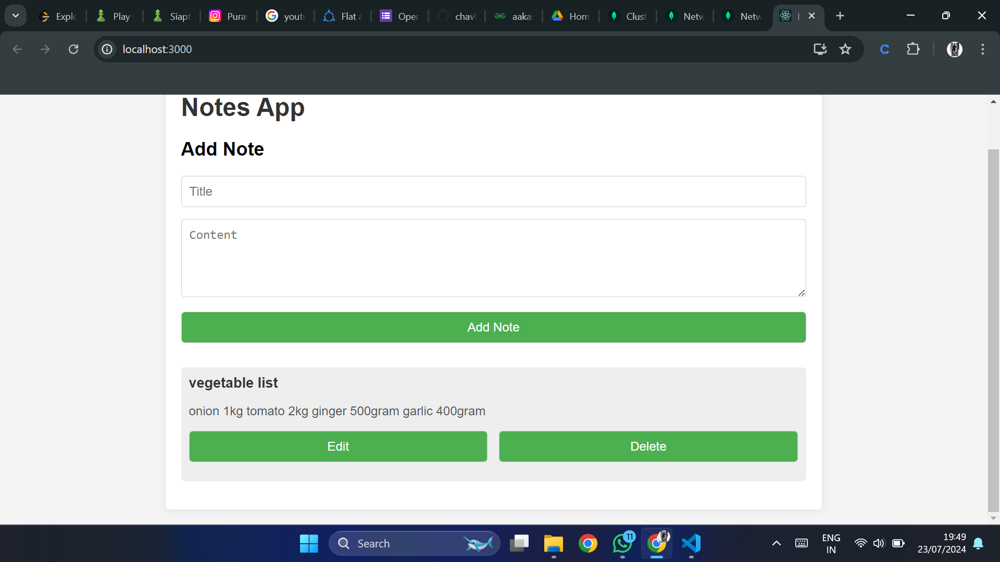

# Notes
This is simple note app which store your basic notes.

<ul>
    <li>create note</li>
    <li>read note</li>
    <li>update note</li>
    <li>delete note</li>
</ul>

<H2>Prerequisites</H2>

<ul>
    <li>NodeJs</li>
    <li>ReactJs</li>
    <li>MongoDB</li>
    <li>ExpressJs</li>
    <li>Bootstrap</li>
</ul>

<H2>Screenshots<H2>

<h3>Home</h3>

<h3>creating note</h3>

<h3>reading note</h3>

<h3>updating note</h3>

<h3>updated note</h3>

